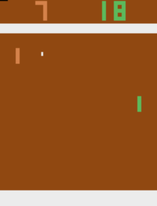
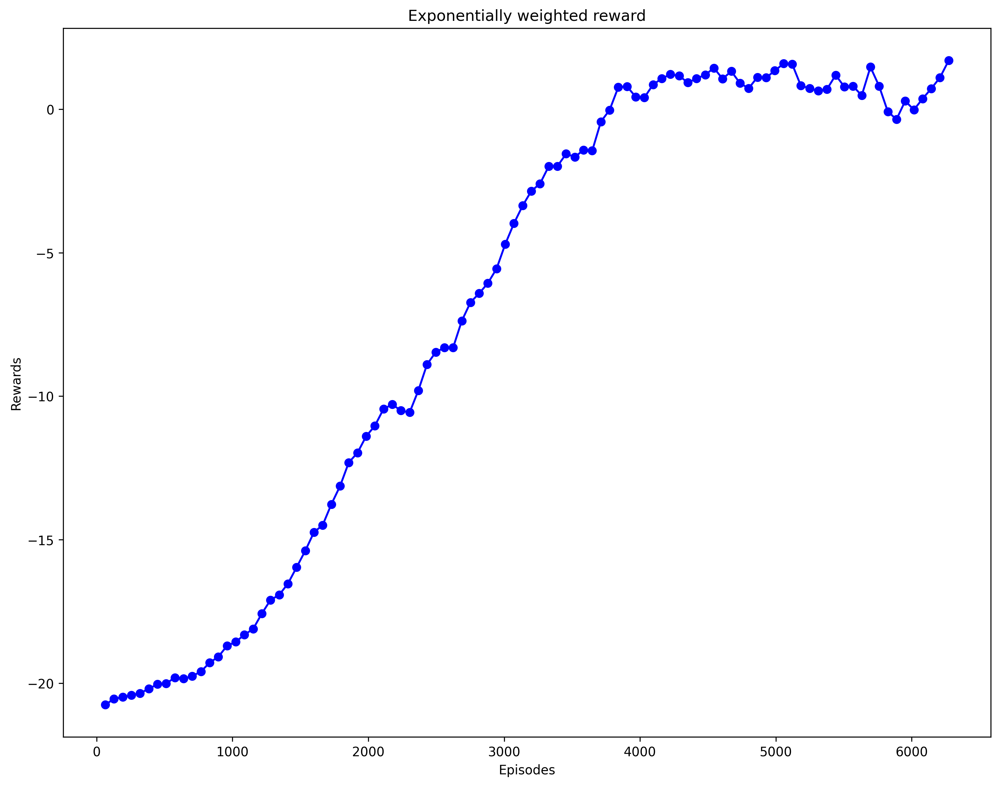

# About

A Pytorch reimplementation of Andrej Karpathy's blog [Deep Reinforcement Learning: Pong from Pixels.](https://karpathy.github.io/2016/05/31/rl/)
The RL agent learns to play Pong via trial and error from pixels, using Policy Gradient RL method implemented in PyTorch.

Slightly modified original code is stored at `karpathys_code.py`, it was adapted for Python 3.10.

# Installation

Requirements:
  - Python 3.10+
  - CUDA Version: 12
  - Install requirements `pip install -r requirements.txt`

### Play

To play, run: `python3.10 play.py --model_path=best_reward_model.pth --device="cuda:0"`

### Train

To train a new model, run: `python3.10 main.py`
Check Andrej Karpathy's [Blog](https://karpathy.github.io/2016/05/31/rl/) for more details of the training, algorithm, etc.

# Model Learning Curve

One episode consists of 21 games, and each point represents exponentially weighted average
across 64 played episodes (64 was used as a training batch size). The graph shows that the model
gradually learns to play the game, and rewards reaches positive values after around 
4000 episodes. 

Learning slows down after ~4000 episodes, since players play the game equally well. 
This prolongs games and, thus, they are truncated by Gymnasium library, resulting 
model receiving a zero reward. This explains learning slow down after ~4000 episodes.

